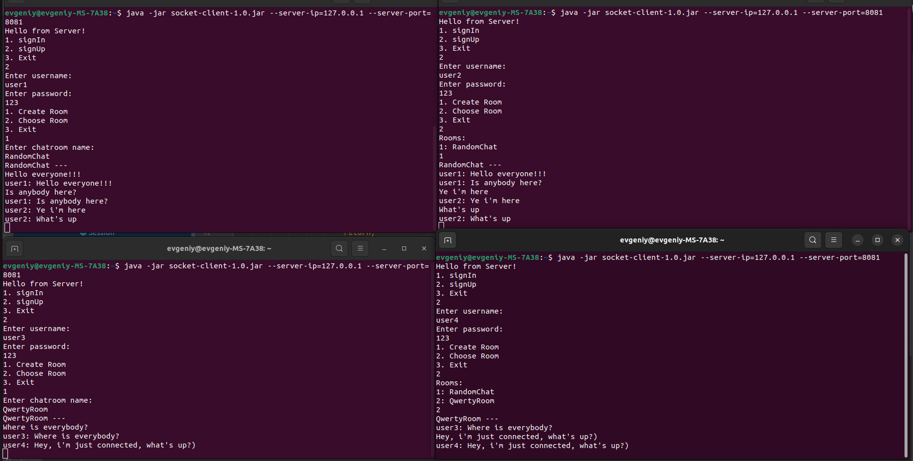

# ConsoleChat
Консольный сетевой чат с использованием сокетов на Java.
Функционал: Регистрация пользователя, вход за существующего пользователя, созадние комнат(чатов) или подключение к существующему.
Внутри чата можно отправлять сообщения, эти сообщения увидят все пользователи, находящиеся в этом чате.
При подключении к чату отображаются последние 30 сообщений в этом чате.

Имеется 2 приложения в виде исполняемого jar: клиентский джарник и серверный.
Для работы серверного джара требуется postgresql, настройки подключения указываются в SocketServer/src/main/resources/db.properties.
При запуске создадутся нужные таблицы для сохранения пользователей, чатов, сообщений.

Установка: Находясь в нужной директории(SocketClient или SocketServer) прописать *mvn package.* 
Запуск клиентского приложения:  *java -jar SocketClient/target/socket-client-1.0.jar --server=ip=IP --server-port=8081.*  
Запуск серверного приложения: *java -jar SocketClient/target/socket-client-1.0.jar --port=8081*

Небольшой пример работы приложения:
   

    

